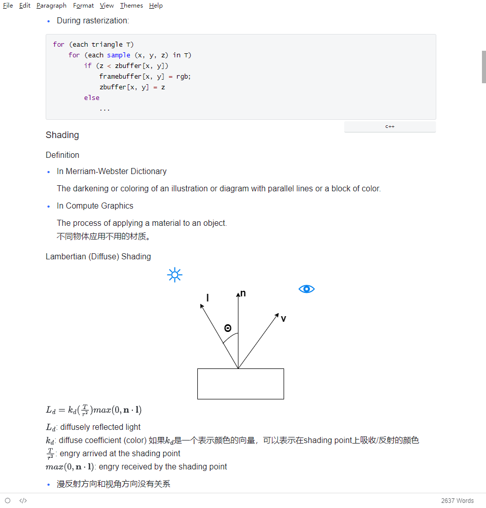

### Academic

### Ash

### Aspartate

### Ava-diana

### Blubook

### Cobalt

### Dyzj

### Gitbook-azure

### Gitbook-slate

### Gitbook-teal

### Github

### Inside

### Lark

### Maize

### Mint

### Mint-dark

### Mlike-dark

### Mlike-light

### Mo

### Mo-dark

### Newsprint

### Night

### Nord

### Panda

### Pixyll

### Refine

### Techo

### Torillic

### Vue

### Vue-dark

### Whitey

